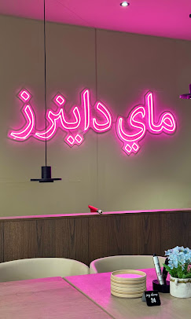

# MYDiners × Daybreak: Digital Growth Foundation

Client proposal deck, built on the Daybreak house system documented in
[PROPOSAL-SYSTEM.md](PROPOSAL-SYSTEM.md).

**Reference:** DB-MYD-001 · V1 · Rosebank × Cape Town / Claremont

| | |
| --- | --- |
| Sections | 19 pages: cover, 17 numbered sections, closing panel |
| Foundation | R37,000 · 74 hours · R33,300 if approved today (10% off) |
| Foundation + Catering | R41,000 · 82 hours · R36,900 if approved today |
| Monthly | Retainer R4,000 or R4,500 · third-party platforms R3,500 · ad-hoc R650 / hour |
| Output | Scrolling deck + A4 PDF (23 sheets) from the same markup |
| Dependencies | None. Three files, no build step. |

```
index.html    styles.css    script.js    netlify.toml    assets/
```

Open `index.html` in a browser. Arrow keys / PageUp / PageDown move between
sections; **PRINT / PDF** in the top bar produces the A4 PDF.

---

## Changing any number

Every figure in the deck is derived at runtime from the data layer at the top of
[script.js](script.js). **Nothing is hand-typed into the HTML**, so the narrative
pages and the commercial pages cannot disagree with each other.

```js
const buildRate = 500;   // every fee = hours × this rate
```

| To change | Edit | What re-derives |
| --- | --- | --- |
| The package prices | `lineItems` hours, or `buildRate` | Both package cards, ledger and totals, workload bar, payment table |
| What is catering-only | the fifth field (`true`) on a `lineItems` row | Which lines Foundation excludes, and both totals |
| The today-only saving | `todayDiscount` | Today prices, savings, payment table, the today-only band |
| The retainer | `retainer` (`hoursPerMonth`, `cateringHoursPerMonth`, `adHocRate`, `noticeDays`) | Monthly fees, hours, monthly totals, hourly rate, notice period |
| Third-party platform costs | `thirdPartyMonthly` | Both package cards, monthly totals, platform cost card |
| Client, date, validity, reference | `proposalData` | Every page header, cover, closing panel |
| The guest list example (slide 07) | `promoExample` | Extra tables and turnover in the callout |
| The revenue scenarios (slide 11) | `revenueModel` | All three figure cards and their calculation lines |
| The measurement funnel (slide 12) | `funnelStages` | Bar widths and every conversion percentage |
| The catering pipeline (slide 10) | `pipeline` | All four pipeline cards |

There are two packages. **Foundation** is every line item except the catering
funnel: 74 hours at R500/hour = **R37,000**. **Foundation + Catering** is every
line: 82 hours = **R41,000**. Approved on the day it is presented, each is 10%
less (**R33,300** / **R36,900**). The retainer is priced off the same `buildRate`
(8 or 9 hours/month = **R4,000** / **R4,500**), and third-party platform costs
add **R3,500/month** on both. Ad-hoc work carries a premium (`adHocRate`, R650)
which is what makes the retainer the better offer. Change one line item's hours
and the package cards, ledger, totals, workload bar and payment table all follow.

The reservation platform is deliberately never named in the deck, the data layer
or this file. Keep it that way until the client has paid: this folder is
published as-is, so anything written here is publicly readable.

`funnelStages` entries carry the index of the stage they are measured against, so
catering enquiries read as a share of *visitors*, not of booking actions.

---

## Imagery

### The cover photograph

The cover's main image is **`assets/cover-interior.jpg`**, the MYDiners pink
neon-sign interior. It is shown without the desaturation and grain applied to the
other scenes so the neon keeps its colour. To swap it, replace the file at that
path. If it is ever missing, the `onerror` fallback shows `assets/interior.svg`,
a drawn placeholder, so the deck never renders broken.

```html

```

### Everything else

`assets/interior.svg`, `table.svg` and `spice.svg` are warm, desaturated **art
direction placeholders**: drawn, clearly illustrative, never presented as
photographs of MYDiners. Swap any of them for a JPEG; the containers are
`object-fit: cover`, so any crop works.

`assets/search-tikka-chicken.jpg` is different: it is a **real, unaltered Google
search result** (cropped only), used as evidence on section 03. Do not retouch
it. If it is re-captured, update the date in the caption beneath it.

Everything else on-screen (phone mockups, floor plan, dashboard, QR pattern,
plated dish) is **built in CSS and inline SVG**, so it stays crisp and editable
and nothing is a screenshot of a real MYDiners system. Mockups are labelled
"Proposed experience · concept" or "Concept" wherever they show a product view.
The QR pattern is decorative and does not resolve to a URL.

---

## Print

`window.print()` → A4, one section per sheet, 23 sheets.

The `@media print` block carries a **compaction pass**: screen sizes are tuned to
a 1180px page, while A4 leaves ~1047px of content at 10mm margins. Section
numbers, headings, list padding and component chrome all shrink so each section
lands on a single sheet. Three sections deliberately run longer:

- **03 The Search Gap**: the evidence screenshot is kept large and legible
- **05 Online Booking**: second sheet ~30% full
- **17 The Investment**: carries both packages, the ledger, payments and monthly
  costs, so it runs to three sheets

**07 Guest List & Promotions** fits one sheet with very little to spare. Its phone
mockup deliberately has no inline `min-height`, so the print size applies.

If you add content, re-check that no section spills by a small amount and leaves
a near-blank sheet. Print preview at A4, scale 100%, background graphics on.

---

## Deploy

Netlify, `publish = "."`, no build command. See [netlify.toml](netlify.toml).
